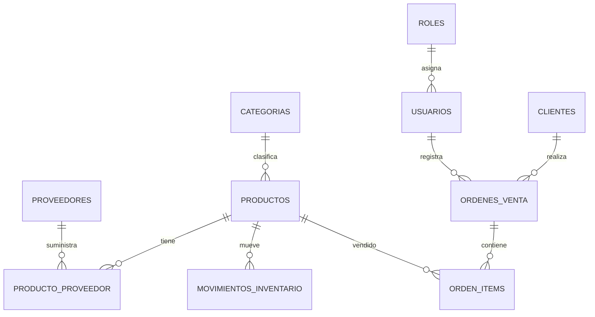

# Modelos de Diseno

## Modelo Entidad-Relacion

## Modelo Relacional

El modelo relacional se encuentra implementado en `sql/ddl/01_schema.sql` con claves primarias, foraneas, restricciones `check`, indices y tabla puente para la relacion N:M.

## Modelo Fisico

PostgreSQL 12+ con tipos `bigserial`, `varchar`, `numeric`, `boolean`, `timestamptz`, `jsonb` e `inet`. La auditoria usa `jsonb` para almacenar valores anteriores y nuevos.
